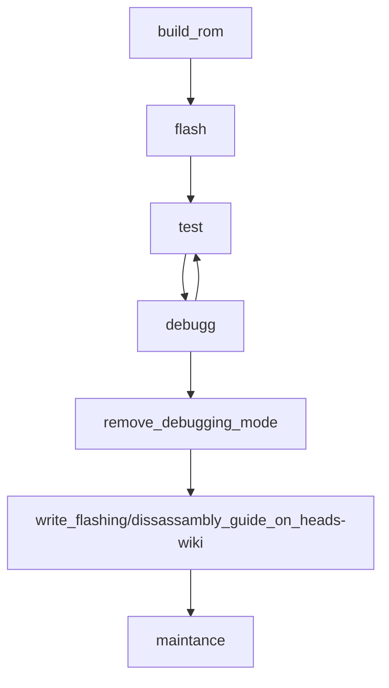
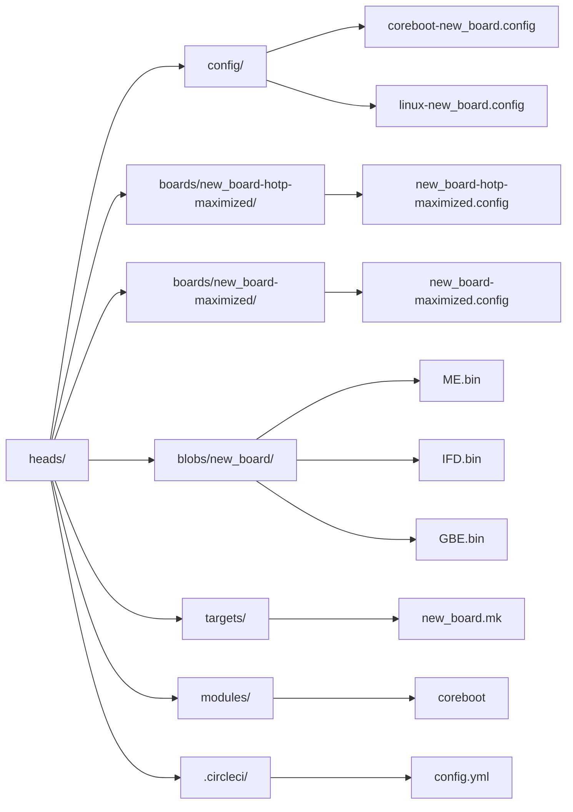

<!-- markdownlint-disable MD033 -->
<details open markdown="block">
  <summary>
    Table of contents
  </summary>
  {: .text-delta }
1. TOC
{:toc}
</details>
<!-- markdownlint-enable MD033 -->

Prerequisites for porting Heads
===
Prerequisites: 
1. coreboot port:  since Heads is a coreboot payload, the board must have fully completed and actively maintained coreboot support. Any known issues should be acceptable to end users. Exceptions include the Librem and Dasharo coreboot forks, where coreboot is used from their respective forks.
2. TPM module: For full Heads functionality, the board must have a TPM module. If it uses fTPM and you plan to neuter the Intel Management Engine (ME), the fTPM must remain functional under coreboot even after neutering ME. Otherwise, a dTPM is required for this board.
3. Technical skills: the person porting the board must have basic knowledge of coreboot, Linux, Bash, Git, and Python to complete the port. While the community is committed to helping, an alternative option is financial contribution for [consultancy services](https://osresearch.net/Consultation-Services/)
4. External programmer: an external programmer is required to flash Heads and, if necessary, to recover from a brick.
5. Users and Board-testers: There should be multiple users and testers interested in using the board, as this makes maintenance and testing easier and benefits the entire ecosystem. You may, of course, port it for yourself first and allow others to join later. However, you must commit to testing—especially after coreboot version bumps or Linux kernel updates. If testing is not done in a timely manner, the board will be moved to an "unmaintained, untested" status. This would be unfortunate, potentially a waste of time, and disappointing for everyone involved.
6. GPU: dGPUs are problematic in Heads for various reasons. While successful ports on older machines with dGPUs exist (TODO: Add link), security may be affected, and there is currently no clear solution for that. (TODO: Link to Matrix coreboot discussion)

The scheme depicts a port cycle. 

TODO (remove source code after feedback)

Files needed to be created/modified are depicted on the scheme.


TODO (remove source code after feedback)


Prerequisites for building the ROM
===
The goal is to build a ROM before the code review. `new_board` refers to the name of your board, e.g., `t480`

coreboot.config:
---
you need a coreboot configuration. Ideally, this config should have already been tested and confirmed to work on the board. Alternatively, you can create one using coreboot's `make menuconfig`.
To ensure everything functions as expected, you may first build the ROM with SeaBIOS and test it. Please follow the upstream documentation, as this will save you time.
Next, the configuration needs to be adapted for Heads, specifying LinuxBoot as the payload and defining the path for required blobs. You can inspect existing configurations for boards in the master branch and select one with a similar architecture (if available). The configuration file should be placed at: `heads/config/coreboot-new_board.config`
* Note:
TPM measured boot (```CONFIG_TPM_MEASURED_BOOT=y```)and verified boot (```CONFIG_VBOOT_LIB=y```) should be enabled. If the board has TPM 2.0 those should be set to `y`. In this case, all TPM 1.2-related options should be commented out using`#`. If the Board has TPM 1.2  the reverse applies—TPM 2.0 options should be commented out. Here is a snipplet for TPM 2.0 configuration. `CONFIG_TPM=y` should be enabled in both cases.
```
CONFIG_TPM2=y
CONFIG_TPM=y
CONFIG_MAINBOARD_HAS_TPM2=y
CONFIG_TPM_LOG_TPM2=y
```
Other parameters depend on the board. It is up to you to determine the correct settings, as not all community members will have access to your board. The file should be named `coreboot-new_board.config` and placed under `config/` folder

linux.config:
---
this should be adopted from a similar board. The file should be named `linux-new_board.config` and placed under `config/` folder.

board.config: 
---
there should be a file `new_board-hotp-maximized.config`, which inherits all the parameters from `new_board-maximized.config` and adds  HOTP verification. This is Heads specific configuration and should be adopted from a similar platform. new_board config should point to the land the coreboot and linux.
You should point in new_board-hotp-maximized and new_board-maximized to the coreboot version e.g. `export CONFIG_COREBOOT_VERSION=24.12`- that will be modified under modules/coreboot (see corresponding section below)
Additionally, the configurations should reference the appropriate coreboot and linux configs created above:
```
CONFIG_COREBOOT_CONFIG=config/coreboot-new_board.config
CONFIG_LINUX_CONFIG=config/linux-new_board.config
```
* For early testing, enabling debug mode is a good idea. However, these options should be removed before merging:
```
export CONFIG_DEBUG_OUTPUT=y
export CONFIG_ENABLE_FUNCTION_TRACING_OUTPUT=y
```
Note: This may cause glitches where the screen output appears overwritten until an arrow key is pressed. This is normal for DEBUG mode, as the additional tracing output uses the same console as fbwhiptail. The issue will disappear once debug options are removed from the board configs.
* It is important to define the correct TPM configuration (TPM 1.2 vs. TPM 2.0), ensuring they are mutually exclusive, similar to the coreboot configuration.
```
#TPM2 requirements
export CONFIG_TPM2_TOOLS=y
export CONFIG_PRIMARY_KEY_TYPE=ecc
```
```#TPM1 requirements
#export CONFIG_TPM=y
```
In the configuration, the path to the folder containing binary blobs must be specified. These are required by coreboot for building the ROM (please see binary blobs session)

modules/coreboot:
---
coreboot fork that will be used should be added under modules/coreboot. 

binary blobs:
---
Check the coreboot configuration for the ported board. This will indicate which binary blobs are required and where they are expected to be located. Heads have scripts under blobs/* which does the magic, called by board configs. Heads has scripts under blobs/* that manage binary blobs automatically. These scripts are invoked by board configurations and are essentially Makefiles that include other Makefiles, which in turn call scripts to download, modify, and place blobs where needed. This process follows coreboot’s philosophy. Those scripts dealing with blobs need to be created/modified.
Generally,  three binary blobs are required: Management Engine (ME), Intel Flash Descriptor Region (IFD), and Gigabit Ethernet (GBE) The IFD and GBE can be extracted from a donor board using coreboot’s ifdtool. For more details, refer to the [uptsream documentation](https://doc.coreboot.org/util/ifdtool/layout.html)
Please note the GBE MAC address should be forged to: `00:DE:AD:C0:FF:EE MAC`. It can be done with [nvmutil](https://libreboot.org/docs/install/nvmutil.html). Due to licensing restrictions, the ME firmware cannot be uploaded to GitHub. However, scripts can be used to build it locally and within CircleCI (a gray area legally, but still possible).
* Note: When calling scripts in Nix-based environments, Python must be invoked explicitly, as Nix does not allow executing Python scripts directly from files. One can use last clean example for t480:`python ./finalimage.py` will work and just `./finalimage.py` will not work. 
Blobs folder should have a script.sh which handles downloading, deactivating ME etc. It should also contain README.md file briefly explaining the process. Hashes of the blobs should stored either in `README.md` or in `hashes.txt file`.

new_board.mk:
---
create a new `targets/new_board.mk` file which deals with calling blobs/script.sh* download and extraction of blobs placing the blobs in correct location.

CircleCI: 
---
modify `.circleci/config.yml` to add support for `new_board`. Initially, configure it to depend directly on musl-cross-make. At this stage, do not reuse caches—this simplifies debugging and ensures a clean build process. 
```
# new_board is based on xx.xx coreboot release, not sharing any buildstack from now, depend on muscl-cross cache
      - build:
          name: new_board-hotp-maximized
          target: new_board-hotp-maximized
          subcommand: ""
          requires:
            - x86-musl-cross-make
```
Under under CircleCI builds are reproducible, meaning you will be able to use the same (bit-to-bit) ROM on different machines to make sure you talk about the same thing, with same flashing technique/regions therefore SPI content. It optimizes the collaboration between peers-board owners. Moreover, CI builds are significantly faster than local builds, reducing overall development time.

* Optional: local builds.
If you really need to build locally during the development stage, pay attention to the helper functions at the end of the Makefiles. It is strongly recommended that local builders review the end of the Makefiles (including modules/* files), as these helper functions were designed to facilitate coreboot and Linux version bumps.
For a completely clean build (the most radical approach), remove all build artifacts using:
```bash
./docker_repro.sh BOARD=new_board real.clean
```
For a less radical approach, run:
```shell
./docker_repro.sh BOARD=new_board real.remove_canary_files-extract_patch_rebuild_what_changed
```
Then, inject any changes into the coreboot fork canary file so that the build system refetches, repatches, and rebuilds the coreboot fork:
```shell
echo "bogus" | sudo tee build/x86/coreboot-t480/.canary
```
Note, patches that attempt to create files that are not expected to exist but exist will fail, showing at console what files already existed that couldn't be created. In this case, you need to remove them manually `rm -rf`, and restart the build with `./docker_repro.sh BOARD=new_board` which will progress until each modules/* required per board config is successfully built.
	
Testing
===

For thorough testing—especially for a new board—using the following template may be beneficial.
Tasks to check, Copy and paste this template into the GitHub message window when reporting test results. Mark completed tasks with an x inside the brackets [ ]. Replace yyy with the relevant information
```
- [ ] Successful external flash link to circleci: https://yyy from commit `yyy` using external programmer model `yyy` on `yyy` Voltage mode
- [ ] Boots successfully after the flashing: 
- [ ] Setting clock prompt on first reboot: ok if triggered correctly after initial flashing and cmos battery disconnected
- [ ] Clean boot detected (no keyring, nothing installed on disk): usb boot proposed and followed: ok
- [ ] Boots on usb: ok
- [ ] OS `yyy` install and reboot: ok
- [ ] Heads functionality- no pubkey detected, but OS detected -> OEM-Factory-reset proposed. Done with `yyy` hardwarekey e.g. nk3: ok
- [ ] On reboot after re-ownership: generate new HOTP/TOTP: ok
- [ ] On reboot: default boot proposes to choose boot default + TPM DUK: ok
- [ ] TPM DUK boots OS version: ok
- [ ] TPM DUK boots QuebesOS 4.2.4: ok
- [ ] wifi works based on OS `yyy`: ok
- [ ] PR0: ok. 
* flashprog -p internal (not locked)
* lock_chip (locks_
* flashprog -p internal (reports locked)
```

Debugging
===
Future debugging from Heads: enter recovery console, with a formatted USB thumb drive (fat32/exfat/ext3/ext4) and then 
```shell
mount-usb --mode rw
cp /tmp/debug.log /media
cbmem -L > /media/coreboot_measured_boot.log
umount /media
```
And then provide log files in a subsequent comment. That would be really helpful if something is still wrong. Of course, this should be modified based on the problem faced.

Pull Request
===

Create an initial PR, with commits relative roughly to the steps above. Please see the guide for contributing. 1 commit does 1 major bullet point.

Then lets collaborate in the PR. Create a heads fork in your own repository, follow/comment linuxboot/heads-wiki#119 TODO create the wiki-page as you go, make sure you sign commits and don't stress too much if this seems a lot. Get a PR started and we will collaborate there. 

Remove debugging mode:
===
One of last PRs should remove the debugging mode and add quite mode. 

Write a flashing/dissasembling guide
===
Take pictures as you dissasemble your board and flash the Heads ROM. You can use them later to write a guide. This will help less technical community members using the board. Your effort will imporove the ecosystem. 
If you cannot manage to finish writing the guide but talented enouph to finish the port just create an issue on the GitHub and drop pictures. We will try to find time to help.
The guide is essential part of the port.

Contribute to maintance
===
Refer to [Contributing on GitHub page](https://github.com/linuxboot/heads/blob/master/CONTRIBUTING.md)

Heads is free as free beer.
In the spirit of open-source software, free knowledge, and communal goodwill, support the Heads and the open source development [Insurgo Initiative - Open Collective](https://opencollective.com/insurgo).
The supply of free beer cannot be infinite. If everyone takes without giving back, at some point, the keg runs dry, and so does the goodwill.
If you enjoy free beer, contribute in some form—whether by bringing code, docs, or financial support. The cycle must be maintained to keep the ecosystem alive. No one wants to be the last guest realizing the fridge is empty and no one restocked it. Together, it is possible to keep the free beer spirit alive—open, shared, and always refreshing. Cheers!

You may examine all [github PRs with the label 'port'](https://github.com/linuxboot/heads/issues?q=label%3Aport+) to gather additional information. Good luck! 
