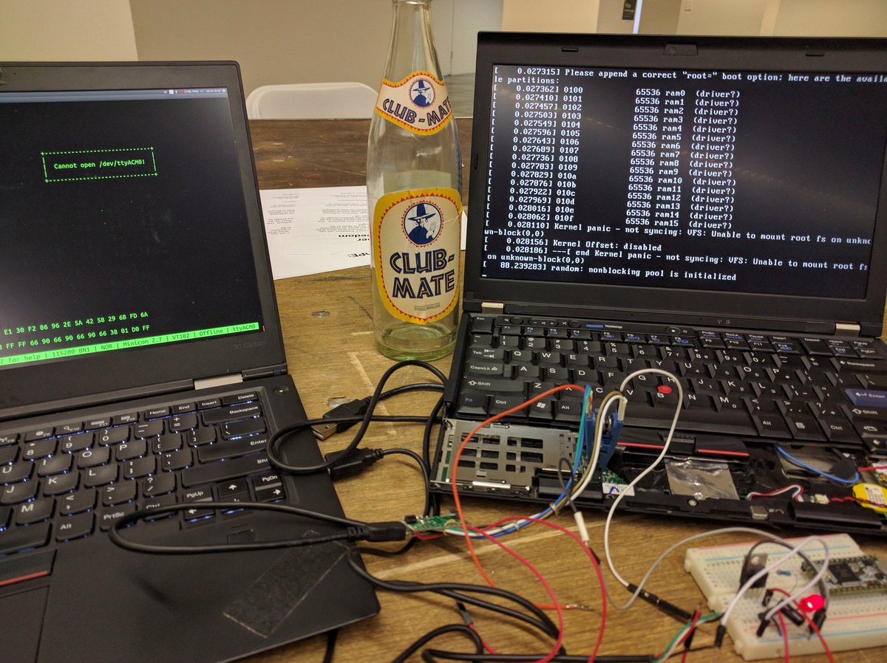

Installing Heads
===

These instructions are only for the Lenovo Thinkpad x230 and require physical
 access to the hardware. There are risks in installation that might brick your
 system and cause loss of data. You will need another computer to perform the
 flashing and building steps. If you want to experiment, consider
 [Emulating Heads](Emulating-Heads.md) with qemu before installing it on your
 machine.

There are five major steps:

* Flashing the boot ROM
* Taking ownership of the TPM
* Installing Qubes
* Sealing disk encryption keys
* Signing Qubes installation

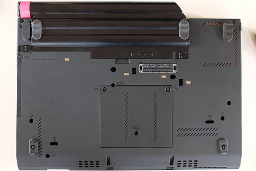

Unplug the system and remove the battery while you're disassembling the machine!
 You'll need to remove the palm rest to get access to the SPI flash chips, which
 will require removing the keyboard. There are seven screws marked with keyboard
 and palm rest symbols.

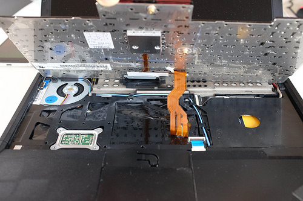

The keyboard tilts up on a ribbon cable. You can keep the cable installed,
 unless you want to swap the keyboard for the nice x220 model.

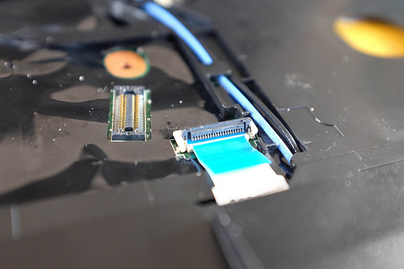

The palm rest trackpad ribbon cable needs to be disconnected. Flip up the
 retainer and pull the cable out. It shouldn't require much force. Once the
 palmrest is removed you can replace the keyboard screws and operate the machine
 without the palm rest. Since the thinkpad has the trackpoint, even mouse
 applications will still work fine.

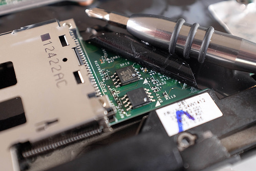

There are two SPI flash chips hiding under the black plastic, labelled "SPI1"
 and "SPI2". The top one is 4MB and contains the BIOS and reset vector. The
 bottom one is 8MB and has the [Intel Management Engine (ME)](https://www.flashrom.org/ME)
 firmware, plus the flash descriptor.

Using a chip clip and a [SPI programmer](https://trmm.net/SPI_flash), dump the
 existing ROMs to files. Dump them again and compare the different dumps to be
 sure that were no errors. Maybe dump them both a third time, just to be safe.

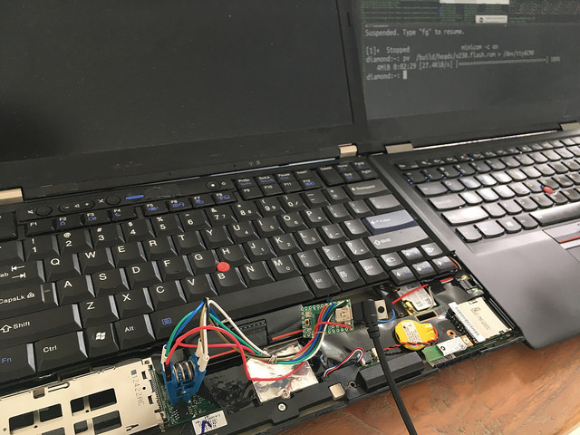

Ok, now comes the time to write the 4MB `build/x230-flash/x230-flash.rom` file
 to SPI2 chip. With my programmer and minicom, I hit i to verify that the flash
 chip signature is correctly read a few times, and then send `u0 400000`↵ to
 initiate the upload. I then drop to a shell with Control-A J and finally send
 the file with `pv x230.rom > /dev/ttyACM0`↵. A minute later, I resume minicom
 and hit i again to check that the chip is still responding.

Move the clip to the SPI1 chip. Read out the chip using `flashrom -r`, keep
 a copy as backup and run `ifdtool -u` on it to enable writing to the flash
 from software later. Also, [clean the ME firmware](Clean-the-ME-firmware).
 This will wipe out the official Intel firmware, leaving only a stub of it to
 bring up the Sandybridge CPU before shutting down the ME. As far as I can
 tell there are no ill effects. Flash back your modified 8MB image. This
 time you’ll send the command u0 800000↵. (you can also use the
 [Skulls project](https://github.com/merge/skulls/tree/master/x230)'s
 `external_install_bottom.sh -m` script to do all this work on the SPI1 chip
 automatically).

Finally, remove the programmer, connect the power supply and try to reboot.

If all goes well, you should see the keyboard LED flash, and within a second the
 Heads recovery splash screen will appear. It currently drops you immediately
 into the shell, to allow you to flash the full 12MB `x230.bin` Heads rom (or
 `build/x230/coreboot.rom` if you've built it locally). If it doesn't work,
 well, sorry about that. Please let me know what the symptoms are or what
 happened during the flashing.

Congratulations! You now have a Coreboot + Heads Linux machine. Adding your own
 signing key, installing Qubes and configuring tpmtotp are the next steps.

On insert a USB drive containing the 12MB Heads rom and mount it using:

```shell
mount-usb
```

This will load the USB kernel modules and mount your drive at `/media`.

Generating your PGP key
===

If you're using a new Yubikey, you'll need to generate your key files. If you
already have the public key stubs for your Yubikey, please proceed
to the next section.  There is some more info in the [GPG guide](http://osresearch.net/GPG))

Insert your Yubikey into the x230, then invoke GPG's the "Card Edit"
function with it targetting the local directory:

```shell
gpg --homedir=/media/gnupg/ --card-edit
```

Go into "Admin" mode and generate a new key inside the Yubikey:

```shell
admin
generate
```

Since this key can be replaced by replacing the ROM, it is not necessary
to make a backup unless you want to.
This will prompt you for the admin pin (`12345678` by default) and then
the existing pin (`123456`).  Follow the other prompts and eventually
you should have a key in `/media/gnupg/`.

Create a single file containing the public key for this Yubikey (the secret key
 lives only in the Yubikey).

```shell
gpg --homedir=/media/gnupg/ --export -a > /media/gnupg/public.key
```

Adding your PGP key
===

Heads uses your own GPG key to sign updates and as a result it needs the
key stored in the ROM image before flashing the full Heads ROM.

Add your key to the Heads ROM using the following command:

```shell
cbfs -o /media/x230.rom -a "heads/initrd/.gnupg/keys/public.key" -f /media/gnupg/public.key
```

Any name can be used as long as the it is preceded by
 `heads/initrd/.gnupg/keys/`.

After these files are added to the `/media/x230.rom`, you should flash the full
 ROM:

```shell
flashrom-x230.sh /media/x230.com
```

Once `flashrom` is complete, reboot (using the `reboot` command)
and now you should now be back in the Heads runtime. It should
display a message that is is unable to unseal TOTP.

Because the reproducible flash has an empty MRC cache, you need to
reboot one more time so that the PCR values as they would be going
forward.

Configuring the TPM
===

There aren't very many good details on how to setup TPMs, so this section could
 use some work.

Taking ownership
---

If you've acquired the machine from elsewhere, you'll need to establish physical
 presence, perform a force clear and take ownership with your own password.
 Should the storage root key (SRK) be set to something other than the well-known
 password?

```shell
tpm-reset
```

There is something weird with enabling, presence and disabling. Sometimes reboot
 fixes the state.

tpmtotp
---

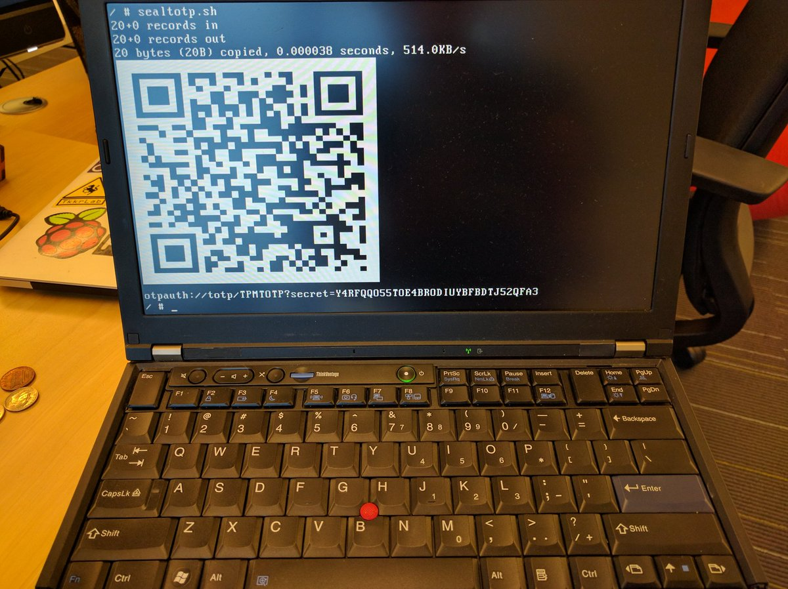

Once you own the TPM, run `seal-totp` to generate a random secret, seal it with
 the current TPM PCR values and store the sealed value in the TPM's NVRAM. This
 will generate a QR code that you can scan with your google authenticator
 application and use to validate that the boot block, rom stage and Linux
 payload are un-altered.


On the next boot, or if you run `unseal-totp`, the script will extract the
 sealed blob from the NVRAM and the TPM will validate that the PCR values are as
 expected before it unseals it. If this works, the current TOTP will be computed
 and you can compare this one-time-password against the value that your phone
 generates.

This does not eliminate all firmware attacks (such as evil maid ones that
 replace the SPI flash chip), but when combined with the WP# pin and BP bits
 should eliminate a software only attack.

Generic OS Installation
===

1. Insert OS installation media into one of the USB3 ports (on the left side)
The Heads boot process supports standard OS bootable media (where the USB drive
 contains the installation media which as created using `dd` or `unetbootin`
 etc.) as well as booting directly from verified ISOs on a plain old partition.
For example, if the USB drive has a single partition, you can put the ISO image
 along with a trusted signature in the root directory:

```shell
/Qubes-R4.0-x86_64.iso
/Qubes-R4.0-x86_64.iso.asc
/Fedora-Workstation-Live-x86_64-27-1.6.iso
/Fedora-Workstation-Live-x86_64-27-1.6.iso.sig
/tails-amd64-3.7.iso
/tails-amd64-3.7.iso.sig
```

Each ISO is verified before booting so that you can be sure Live distros and
 installation media are not tammpered with, so this route is preferred when
 available.  You can also sign the ISO with your own key:

```shell
gpg --output <iso_name>.sig --detach-sig <iso_name>
```

Some distros require additional options to boot properly directly from ISO.  See
 [Boot config files](Boot.md) for more information.
2. Boot from USB by either running `usb-scan` or reboot into USB boot mode (hit
 'u' before the normal boot)
3. Select the install boot option for your distro of choice and work through the
 standard OS installation procedures (including setting up LUKS disk encryption
 if desired)
4. Reboot and your new boot options should be available to be chosen by
 selecting 'm' at the boot screen

If you want to set a default option so that you don't have to choose at every
 boot, you can do so from the menu by selecting 'd' on the confirmation screen.
 You will also be able to seal your disk encryption key using the TPM allowing
 you to use ensure only a boot password and the proper PCR state can unlock this
 yet.

(\*) Ubuntu/Debian Note: These systems don't read `/etc/crypttab` in their
 initrd, so you need to adjust the crypttab in the OS and `update-initramfs -u`
 to have it attempt to use the injected key.  Due to oddities in the cryptroot
 hooks, you also need keyscript to be in `/etc/crypttab` even as a no-op
 `/bin/cat`:

`sda5_crypt UUID=XXXXXXXX-XXXX-XXXX-XXXX-XXXXXXXXXXXX /secret.key luks,keyscript=/bin/cat`

(Credit to [http://www.pavelkogan.com/2015/01/25/linux-mint-encryption/](http://www.pavelkogan.com/2015/01/25/linux-mint-encryption/)
 for this trick).

Installing Qubes
===

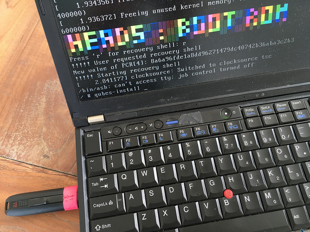

Plus in the USB stick with the R4.0 install media into one of the USB3 ports (on
 the left side of the x230) and boot into USB mode (hit 'u' at the prompt),
 then boot using this option:

```text
2. Install Qubes R4.0 [kernel /isolinux/xen.gz console=none]
```

If that completes with no errors it will launch the Xen hypervisor from the
 x230's ROM image and start the Qubes installer.  The first few seconds are run
 with an archaic video mode, so things appear a little weird, but once the dom0
 kernel initializes the graphics it should look right.

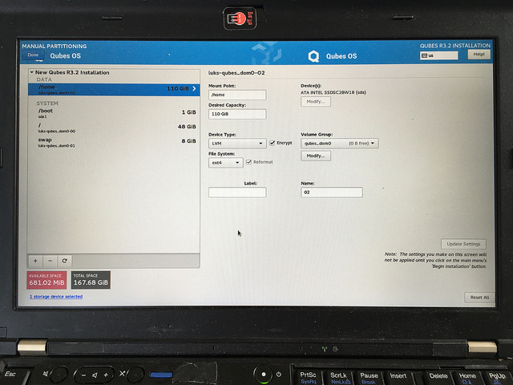

Use default QubesOS partitioning scheme for QubesOS 4.x

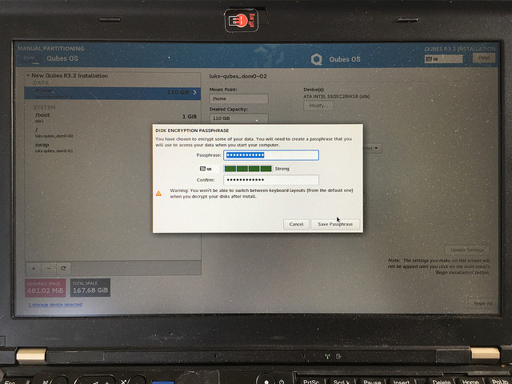

The disk encrypt password that you enter here will be used as the
"recovery password" later.  It should be a long value since you won't
have to enter it very often; only when upgrading the Heads firmware
or if there is a need to recover the disk on an external machine.
You will need it again shortly, so don't lose it yet.

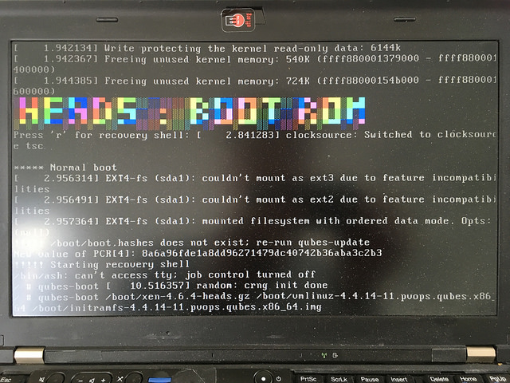

Once Qubes has finished installing, you'll need to reboot and select the 'Boot
 menu' option by hitting 'm'.

Select the first boot option:

```text
1. Qubes, with Xen hypervisor [...]
```

Then make this the default boot entry by hitting 'd'.  This will also allow you
 to seal the disk encryption key.

You will need to input the disk recovery key here (almost for the last time),
 and this should start the final stage of the Qubes installer.  Under
 `Configure Qubes` you should select `Create USB qube holding all USB controllers`
 so that they are protected from outside devices.  This step takes a little
 while as the templates are configured...

Eventually this will be done and you can click "Finish", then Qubes will
give you a login screen with your login password.

If you choose to add the disk encryption key to the TPM, you'll need to specify
 which LUKS volume.  A default Qubes install will work if you leave the
 'Encrypted LVM group?' response blank and enter `/dev/sda2` when asked about
 'Encrypted devices?'.  For more details see the TPM Disk encryption keys
 section below. You'll then be asked to enter the disk recovery key as well as
 the new boot password you'll use to unseal that key.

Once the key sealing process is complete, it will ask you to insert your GPG
 card then enter your PIN to sign the config.  After this, it will reboot back
 to the main boot menu.  Disconnect your GPG card otherwise Qubes might think
 you have a USB keyboard.

To start Heads now (and in the future), just hit 'y' for default boot.

This should start the final stage of the Qubes installer.  Under
'Configure Qubes' you should select `Create USB qube holding all USB controllers`
 so that they are protected from outside devices.  This step takes a little
 while as the templates are configured...

Eventually this will be done and you can click "Finish", then Qubes will
give you a login screen with your login password.

After the first reboot, the boot entry will be different post-installation, so
 after you hit 'y' to select default boot you will see a message:

```text
!!! Boot entry has changed - please set a new default
```

This will also happen on OS updates that changed the boot process (updating the
   kernel or the initramfs, etc.).  If someone has tampered with your `/boot`
   partition, this can also happen, so if you're not sure of the situation,
   don't proceed.

Choose the first option again ('1'), then make it the new default ('d'), confirm
 that you're modifying the boot partition ('y'), and that you don't need to
 reseal the disk key ('n').  You'll be asked to insert your GPG card and enter
 the PIN to sign the new configs and the system will reboot and allow you to
 proceed as normal.

Installing extra software
---

dom0 probably has updates available. You'll want to install them before
 switching `/` to read-only and signing the hashes:

```shell
sudo qubes-dom0-update
```

powertop is useful for debugging power drain issues. In dom0 run:

```shell
sudo qubes-dom0-update powertop
```

You might want to make the middle button into a scroll wheel. Add this to
 `/etc/X11/xorg.conf.d/20-thinkpad-scrollwheel.conf`

```text
Section "InputClass"
  Identifier  "Trackpoint Wheel Emulation"
  MatchProduct  "TPPS/2 IBM TrackPoint|DualPoint Stick|Synaptics Inc. Composite TouchPad / TrackPoint|ThinkPad USB Keyboard with TrackPoint|USB Trackpoint pointing device|Composite TouchPad / TrackPoint"
  MatchDevicePath  "/dev/input/event*"
  Option    "EmulateWheel"    "true"
  Option    "EmulateWheelButton"  "2"
  Option    "Emulate3Buttons"  "false"
  Option    "XAxisMapping"    "6 7"
  Option    "YAxisMapping"    "4 5"
EndSection
```

You'll probably want to enable fan control, as described on [ThinkWiki](http://www.thinkwiki.org/wiki/Fan_control_scripts).

Disabling the ethernet might make sense to save power

TPM Disk encryption keys
---

The keys are currently derived only from the user passphrase, which is expanded
 via the LUKS expansion algorithm to increase the time to brute force it. For
 extra protection it is possible to store the keys in the TPM so that they will
 only be released if the PCRs match.

If you want to use the TPM to seal a secret used to unlock your LUKS volumes:

1. Enter recovery mode
2. Ensure that your the boot devices is mounted: `mount -o ro /dev/sda1 /boot`
 or whatever is appropriate
3. Insert your GPG card
4. Run `kexec-save-key -p /boot/ ...` with the followed by options appropriate
 to your OS.  The key will be installed in all devices in the LVM volume group
 as well as any other devices specified after the `-l` option.

Examples for the `kexec-save-key` parameters:

| Installation Type | Command |
| ---- | ---- |
| Previous Heads installation | `kexec-save-key -p /boot/ -l qubes_dom0` |
| Default Qubes / Default Fedora 25 | `kexec-save-key -p /boot/ /dev/sda2` |
| Default Ubuntu 16.04 / Debian 9 (\*) | `kexec-save-key -p /boot/ /dev/sda5` |

Reboot and you will be prompted for your boot password when that device is
 used to boot in the future.

NOTE: should the new LUKS headers be measured and the key re-sealed with those
 parameters? This is what the Qubes AEM setup uses and is probably a good idea
 (although we've already attested to the state of the firmware).

This is where things get messy right now. The key file can not persist on disk
 anywhere, since it would allow an adversary to decrypt the drive. Instead it is
 necessary to unseal/decrypt the key from the TPM and then bundle the key file
 into a RAM copy of Qubes' dom0 initrd on each boot. The initramfs format allows
 concatenated cpio files, so it is easy for the Heads firmware to inject files
 into the Qubes startup script.
