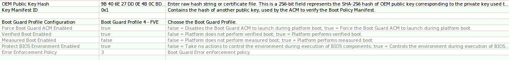
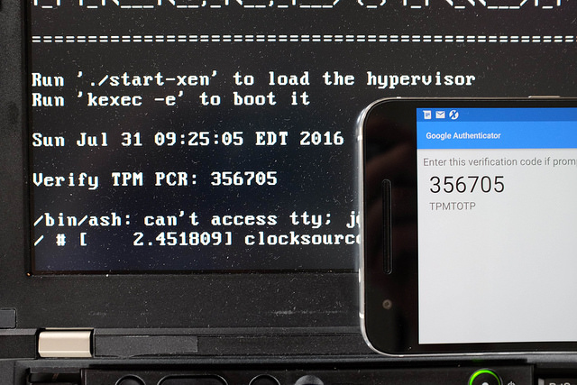
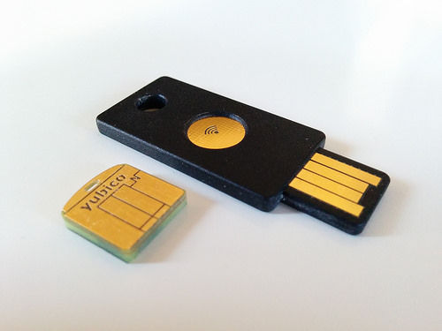
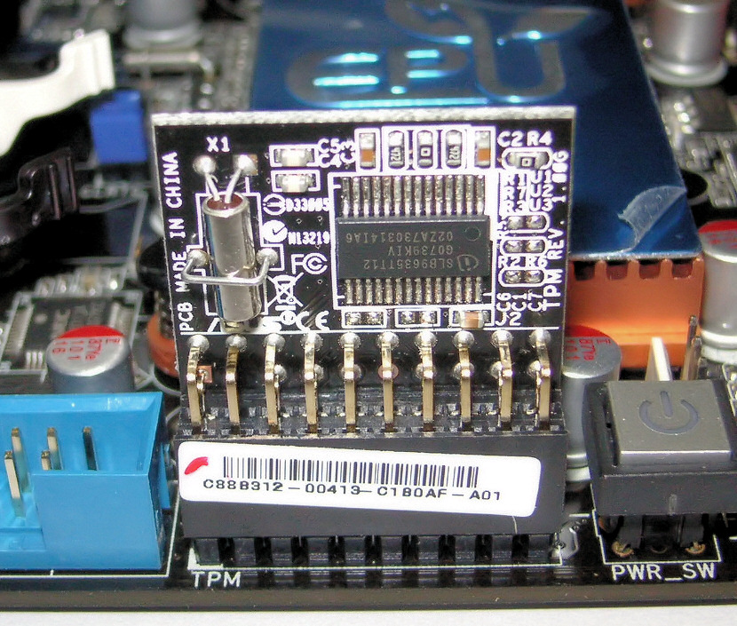

Keys and passwords in Heads
====
There are "too many secrets" involved in booting a Heads system.  Luckily most of them are stored in hardware and only a few need to be memorized by the users.  This page attempts to document their usage and the risks if an attacker can compromise the different keys.

* Management Engine signing key
* Bootguard ACM fuses (hash of OEM public key)
* TPM Owner password (used to initialize counters, NVRAM spaces, etc)
* TPM Endorsement Key
* TPM counter key
* TPMTOTP secret (shared with phone authenticator)
* TPM disk encryption key (stored in the TPM, sealed with PCRs and encrypted with disk unlock key)
* Disk unlock key (entered by the user on every boot to unseal the TPM disk encryption key)
* Disk recovery key (created when the system is first installed, used rarely, if the TPM fails or if the PCRs change)
* LUKS disk encryption key (two copies, one encrypted with TPM disk encryption key, one encrypted with disk recovery key)
* User GPG private key (stored in a hardware token, not available to normal system)
* User GPG public key (stored in the ROM, used to validate xen, Linux dom0, etc)
* User login password
* Root password

Management Engine and Bootguard ACM fuses
---

The very first key used in the system is Intel's public key that signs the Management Engine firmware partition table in the SPI flash.  This key is stored in the on-die ROM of the ME and the ME will not start up if this signature does not match.  An attacker who controls this key (which is highly unlikely) can subvert the Bootguard checks as well as the measured boot process.

The [Bootguard fuses](https://trmm.net/Bootguard) fuses provide protection against most "evil maid" attacks against the firmware.  The hash of the ACM signing key is set in write-once fuses in the CPU chipset and during the CPU bringup phase the ME and the CPU microcode cooperate in some undocumented way to validate the "Startup ACM" in the SPI flash.  Since this key is fused into hardware, an evil maid attack would need to replace the CPU to install malicious firmware into the SPI flash.  The x230 Thinkpads do not support bootguard and only the Librem laptops ship with unfused keys.

An attacker who controls this key can flash new firmware via hardware means (and possibly remotely via software, unless other steps are taken).

TPM Owner password
---
As part of setting up Heads the TPM is "owned" by the user and the owner password is set.  This clears all existing NVRAM and spaces (but does not reset counters?).

Are there any consequences of an attacker controlling this key?

TPMTOTP shared secret
---

Since humans have trouble doing RSA public key cryptography in their brains, Heads uses [TPM TOTP](https://trmm.net/Tpmtotp) to let the system attest to the user that the firmware is unmodified.  During system setup a random 20-byte value is generated and shared (via QR code) to the user's phone as well as sealed with the correct TPM PCR values into the TPM NVRAM.  On subsequent boots the TPM will unseal the secret if and only if the PCRs match, and the computer then generates a one-time password based on the current clock time, which the user can compare to the value displayed on their phone.  A new secret must be generated each time the firmware is updated since this will change the PCRs.

If an attacker can control this shared secret (such as by directly sending PCR values into the TPM) they can install malicious firmware in the SPI flash and generate valid TOTP codes.

TPM counter key
---
The TPM's increment-only counters can be used to prevent roll-back attacks on the signed kernel and initramfs configurations.  An attacker who controls this key can increment the counter, causing a denial of service attack against the system, but it does not provide any access to encrypted data nor any way to roll back to an old version.

TPM disk encryption key
---
The TPM NVRAM also stores one of the disk encryption keys, which is encrypted with the user's disk unlock password and sealed with the TPM PCR values for the firmware and the LUKS headers on the disk.  On every boot the user types in their password and the TPM will unseal and decrypt the disk encryption key if and only if the firmware is unmodified and the password matches.  Since the TPMTOTP one-time code matched, the user can have confidence that the firmware is unmodified before they enter their password.  If the system is booted in recovery mode, the PCRs will not match and this key is not accessible to the user.

The Heads firmware inserts this key into the Qubes `initramfs.cpio` as `/secret.key`, which is listed in the `/etc/crypttab` file as the decryption key for the various partitions.  The dracut/systemd startup scripts will read the `/etc/crypttab` file and use it to decrypt the drives without further user intervention.

The sealed blob is not secret since it is both encrypted and sealed, but if an attacker can extract this unsealed and decrypted key they can decrypt the data on the disk.  If they extract the TPM they can set the PCRs to the correct values and attempt to brute force the unlock code, although the TPM should provide some rate limiting. TODO: Can the TPM also flush the keys if too many attempts are made?

Disk recovery key
---
During initial system setup the disk is encrypted with a user chosen passphrase.  This key is only entered if the TPM PCRs have been changed, such as following a firmware update, or if the disk has been moved to a new machine and the user needs to back up the code.  If the system is booted into recovery mode, the TPM PCRs will not match the TPM sealed encryption key, so the user will need to enter the recovery key to decrypt the drives.

If an attacker gains control of this recovery key they can decrypt the disk to get access to the data, but not necessarily the system configuration if dm-verity is configured.  They can also add additional disk decryption keys, although this will be detected by the TPM measurement of the LUKS headers.

LUKS disk encryption key
---
The TPM disk encryption and user's disk recovery keys are not the actual encryption keys for the disk; they are passed through [PBKDF2](https://en.wikipedia.org/wiki/PBKDF2) and the result is used to encrypt the actual disk encryption key, which is stored in the LUKS header on the disk.  Under normal circumstances this key is not visible to the user and is only an implementation detail.

Access to this key has the same risks as the disk recovery key.

Owner's GPG key
---

The owner of the machine generates a GPG key pair as part of installing Heads.  The public key is inserted into the ROM image that is flashed and the owner signs the `/boot/boot.sh` script as well as the Xen hypervisor, the dom0 Linux kernel and initramfs, the TPM version counter of the system, and the dm-verity root hash if configured.  Ideally the private key does not live on the machine, but instead is in a Yubikey or other hardware token.

TODO: Can this be used in the disk decryption process?

An attacker who controls this private key can replace executables in `/boot` and if they also control the disk encryption key they can tamper with files in a dm-verity protected root filesystem.

User login password
---
The user's login password is used to control access to the system once it has booted.

An attacker who controls this key can access the system and the decrypted disks if they gain physical access to the system while it is running or asleep.  This provides access to the data on the drive, but not necessarily the ability to modify a dm-verity protected root filesystem.

Root password
---
The root password is not enabled by default on Qubes, so it is functionally equivalent to the login password.  Other operating systems might differ.

TPM PCRs
====

The actual assignment needs to be updated in the code; there are outstanding issues (
[MRC cache](https://github.com/osresearch/heads/issues/150),
[SMM reloc](https://github.com/osresearch/heads/issues/13)
) that need to be resolved as well.  Until then this is a rough draft of how Heads uses the TPM PCRs.

0: Nothing for the moment

1: Nothing for the moment

2: Boot block, ROM stage, RAM stage, Heads linux kernel and initrd (and MRC? this should be separate)

3: Nothing for the moment

4: Boot mode (0 during `/init`, then `recovery` or `normal-boot`)

5: Heads Linux kernel modules

6: Drive LUKS headers

7: Heads user-specific config files
