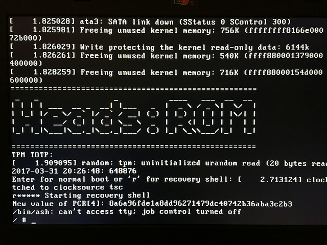
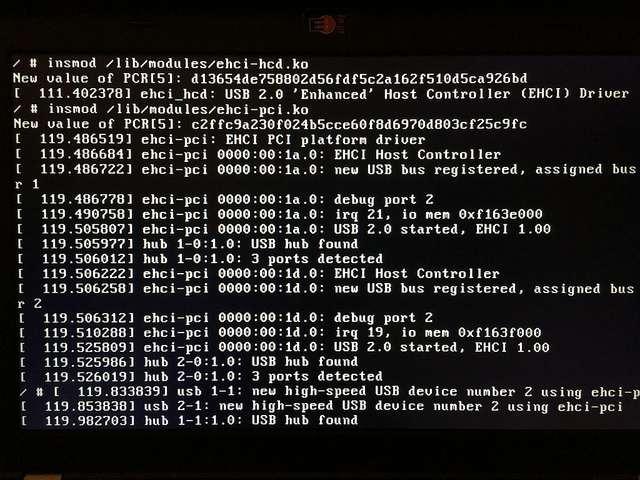
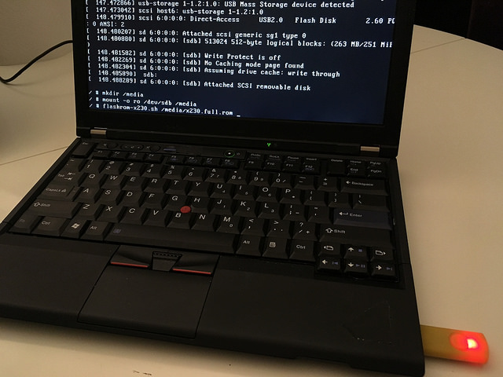
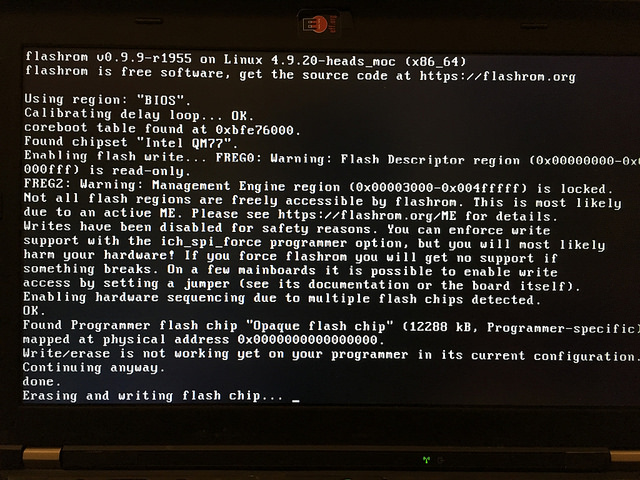
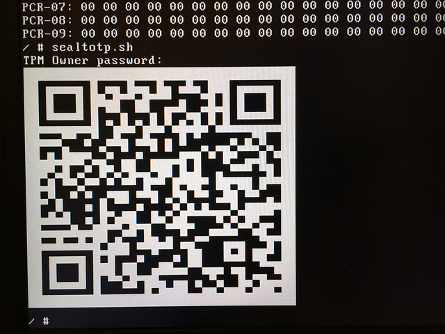

Upgrading Heads
===

The first time you install Heads, you'll need a
[hardware flash programmer](https://trmm.net/SPI_Flash) to be able to
replace the existing vendor firmware.  Subsequent upgrades can be
performed via software, although you'll probably want a hardware programmer
since we don't have a fail-safe recovery mechanism in the event of
a bad flash or buggy firmware.

Additionally, *reflashing the firmware will change the TPM PCRs*.
This will require generating a new TPM TOTP token and a new drive
encryption key.  Be sure you have your TPM owner's password and your
disk encryption recovery key or passphrase available since, by design,
the disk key is not accessible to the recovery shell.

Recovery shell
---



If the flash protection bits are set correctly it is not possible to
rewrite the firmware from the normal OS.  You'll need to reboot
to the Heads recovery shell (hit `r` after the TPM TOTP prompt).

Mounting the USB media
---



The Heads boot process does not have USB or network drivers by default
and neither does the recovery shell (although this might change).
You need to load the Linux kernel modules, which will change the
default module PCR 5:

```shell
insmod /lib/modules/ehci-hcd.ko
insmod /lib/modules/ehci-pci.ko
```

When you insert the drive you'll see a console message about the partitions
on the new device.  Typically it will be the first partition, `/dev/sdb1`,
or sometimes just `/dev/sdb` if there is no partition table.  Make a
directory and mount the device read only:

```shell
mkdir /media
mount -o ro /dev/sdb1 /media
```

Flashing the ROM
---



There is a helper script `/bin/flashrom-x230.sh` that uses the x230
flash ROM layout and the Heads modified version of `flashrom` to
write to the chip.  One of the modifications is to avoid touching or
reading the ME section, so it is not necessary to have used the
[ME cleaner](Clean-the-ME-firmware.md) or unlocked the flash descriptor.

```shell
flashrom-x230.sh /media/x230.full.rom
```



If all goes well it will write for about a minute and then report
success.  Due to hacks in `flashrom`, it does not read back what it
wrote to verify, so hopefully it worked.

Reboot and verify that the new firmware is running.  You'll be dropped
into the recovery shell immediately since the TPM TOTP secret will not
be unlocked.  Since the first boot after flashing will also adjust
the MRC cache, it is necessary to do a second reboot to ensure that
the TPM values are at their persistent state
([issue #150](https://github.com/osresearch/heads/issues/150) aims to fix this).

Regenerating the TOTP token
---



After the second post-flash reboot, generate a new token and store the
QR code in your phone by running:

```shell
sealtotp.sh
```

This needs the TPM owner password to be able to define the NVRAM space.
(todo: [issue #151](https://github.com/osresearch/heads/issues/151)).

Resealing the disk encryption keys
---

When you get to the standard boot menu and after you verify the TOTP, select 'm'
 to go to the full boot menu.  Select the option you want (usually the first),
 make it the default by hitting 'd' and also say 'y' when asked to reseal the
 disk keys.
