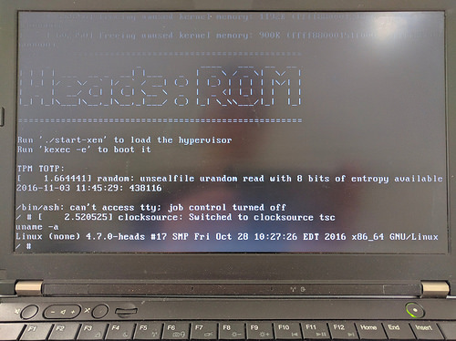
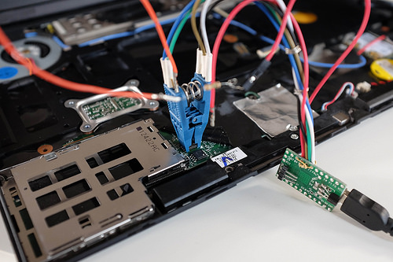
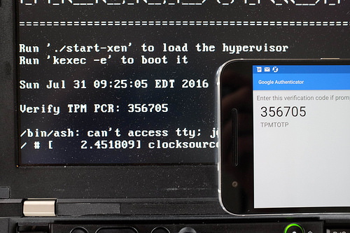
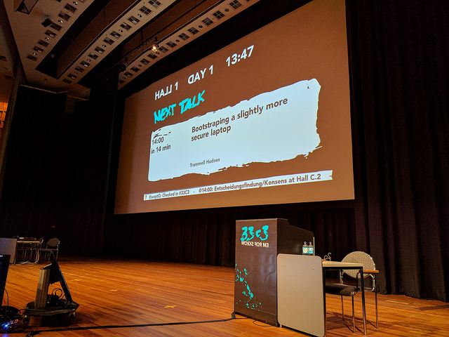

Slack Open Source Firmware
===

* [Register to Open Source Firmware](https://slack.osfw.dev/)
* [Head's channel](https://osfw.slack.com/archives/C92MNSRC1)

Using Heads
===

* [A Beginner's Guide into Building and Installing Heads](Beginner-Installation-Guide.md)
* [Installing Heads](Installing-Heads.md) on an x230 Thinkpad
* [Upgrading Heads](Upgrading.md), including how to generate your TOTP token
* [Keys, Passwords and PCRs in Heads](Keys.md) (rough draft)
* [Boot config files](Boot.md)
* Qubes specific configurations (to be written)
* Server specific configurations (to be written)

Developing Heads
===

* [A Beginner's Guide into Building and Installing Heads](Beginner-Installation-Guide.md)
* [The Heads build process](Building.md) and adding a new sub-module
* [Open issues](https://github.com/osresearch/heads/issues)
* [Emulating Heads](Emulating-Heads.md) (with qemu)
* [Porting to a new mainboard](Porting.md) (rough draft)

Releases
===

There are currently no binary downloads; you must build from source to ensure
 that you can add your own GPG keys to the image to sign your OS installation.

The current release is [0.2.1](https://github.com/osresearch/heads/releases/tag/v0.2.1)
 and is one of the first that is close to usable for other users.  There are
 changes to how the Heads `/init` figures out what to `kexec` and how it
 interacts with the TPM.

Heads buils should be fully reproducible on any Linux-ish system
 ([OSX build is not supported](https://github.com/osresearch/heads/issues/96)).
 If you don't get the same hashes as reported on the release page, please file
 an issue against the [reproducible build milestone](https://github.com/osresearch/heads/milestone/1).

Overview
===

Heads is an open source custom firmware and OS configuration for laptops
and servers that aims to provide slightly better physical security and
protection for data on the system. Unlike Tails, which aims to be a
stateless OS that leaves no trace on the computer of its presence, Heads
is intended for the case where you need to store data and state on the
computer.  It is influenced by several years of firmware vulnerability
research ([Thunderstrike](https://trmm.net/Thunderstrike) and
[Thunderstrike 2](https://trmm.net/Thunderstrike_2)) as well as many
other researchers' work
("[Hardening hardware and choosing a #goodBIOS](https://media.ccc.de/v/30C3_-_5529_-_en_-_saal_2_-_201312271830_-_hardening_hardware_and_choosing_a_goodbios_-_peter_stuge#t=2372)
" by Peter Stuge,
"[Beyond anti evil maid](https://media.ccc.de/v/32c3-7343-beyond_anti_evil_maid)
 " by Matthew Garret,
"[Towards (reasonably) trustworthy x86 laptops](http://www.theregister.co.uk/2015/12/31/rutkowska_talks_on_intel_x86_security_issues/)"
by Joanna Rutkowska,
"[LightEater malware seek GPG keys in Tails](http://www.theregister.co.uk/2015/03/19/cansecwest_talk_bioses_hack/)"
by Kallenberg and Kovah, etc.).

Heads is not just another Linux distribution -- it combines physical
hardening of specific hardware platforms and flash security features with
custom coreboot firmware and a Linux boot loader in ROM.  This moves
the root of trust into the write-protected region of the SPI flash and
prevents further software modifications to the bootup code (and on
platforms that support it, [Bootguard](https://trmm.net/Bootguard) can
protect against many hardware attacks as well).  Controlling the
first instruction the CPU executes allows Heads to measure every step of
the boot firmware and configuration into the TPM, which makes it possible
to attest to the user or a remote system that the machine has not been
tampered with.
While modern Intel CPUs require binary blobs to boot, these non-Free
components are included in the measurements and are at least guaranteed
to be unchanging.  Once the system is in a known good state, the TPM is
used as a hardware key storage to decrypt the drive.

Additionally, the hypervisor, kernel and initrd images are signed by
keys controlled by the user, and the OS uses a signed, immutable root
filesystem so that any software exploits that attempt to gain persistence
will be detected.  While all of these firmware and software changes don't
secure the system against every possible attack vector, they address
several classes of attacks against the boot process and physical hardware
that have been neglected in traditional installations, hopefully raising
the difficulty beyond what most attackers are willing to spend.

Further reading
---

* [Heads FAQ](https://trmm.net/Heads_FAQ) addresses some of the questions
 related to why does this project exist.
* [Presentation at 33c3](https://trmm.net/Heads_33c3)
* [Heads threat model](https://trmm.net/Heads_threat_model) goes into more
 detail about what classes of threats Heads attempts to counter.
